<a href="https://deannacarina.github.io/BCAwareness/"><h1>The Breast Review</h1></a>
Hackathon Project in partnership with IT Labs. Deadline Monday 15th November 2022 @ 3pm.

## Contents
<ul>
    <li>
        <a href="#Introduction"><strong>Introduction</strong></a>
    </li>
    <li>
        <a href="#Collaborators"><strong>Collaborators</strong></a>
    </li>
    <li>
        <a href="#UX"><strong>UX</strong></a>               
    </li>
    <li>
        <a href="#Technologies"><strong>Technologies</strong></a>
    </li>
    <li>
        <a href="#Features"><strong>Features</strong></a>
    </li>
    <li>
        <a href="#Testing"><strong>Testing</strong></a>   
    </li>
    <li>
        <a href="#Deployment"><strong>Deployment</strong></a>
    </li>
    <li>
        <a href="#Research"><strong>Research</strong></a>
    </li>
    <li>
       <a href="#Credits"><strong>Credits</strong></a> 
    </li>
    <li>
        <a href="#Screenshots"><strong>Screenshots</strong></a>
    </li>
</ul>

## Introduction
The Breast Review website covers some educative information on breast cancer awareness. The steps to take in examining your breasts, how often the breasts should be examine, risks factors associated with breast cancers and why early detection can save lives.
 
The World Health Organisation (WHO) Objectives is to reduce global breast cancer mortality by 2.5% per year, thereby averting 2.5 million breast cancer deaths globally between 2020 and 2040. Reducing global breast cancer mortality by 2.5% per year would avert 25% of breast cancer deaths by 2030 and 40% by 2040 among women under 70 years of age. The three pillars toward achieving these objectives are: health promotion for early detection; timely diagnosis; and comprehensive breast cancer management. It is therefore imperative for frequent reviews on the breast for early detection. 
 
We created this website with HTML and CSS with the use of other technologies.
There are also contact links at the bottom of all pages with other resourceful links/sites.

### Demo
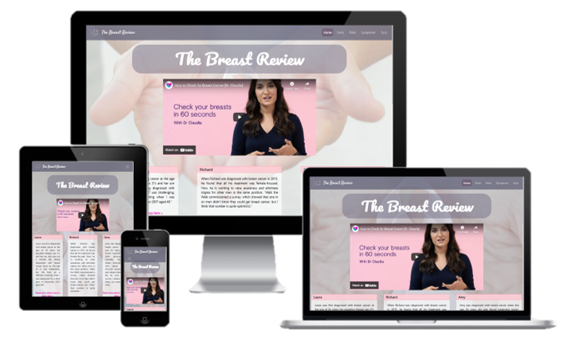

## Collaborators
<ul>
    <li>Hideo Nishimura</li>
    <li>Kike Bello</li>
    <li>Fernanda G</li>
    <li>Katherine Biggs</li>
    <li>Deanna Sale</li>
</ul>
Project Facilitator: Elvira Shorko

## UX
### Strategy

#### Vision
<em>The Breast Review</em> is an educational tool to increase the knowledge and awareness surrounding Breast Cancer. It will consist of a number of separate pages pertaining to different areas of breast cancer awareness such as the risks, the symptoms and some interesting facts. There will also be an interactive quiz for visitors to the website to encourage the cementing of knowledge through an activity. On the home page there will be a video showing how to check for breast cancer and real life stories of journey's from people who have been affected by breast cancer - both men and women.

Despite breast cancer being one of the most well researched and known-about cancers, there are still a massive amount of breast cancer related deaths that could have been prevented if it were for early detection and education. Our hope for this website is to have a quick, easy and informative resource for anybody who would like to learn more about how to detect breast cancers.

The graphic below shows all of the potential pages and the content within that we could add to this website, some of these will be added and some won't - this will be talked about more in-depth in the FEasibility/Importance section of the README. 
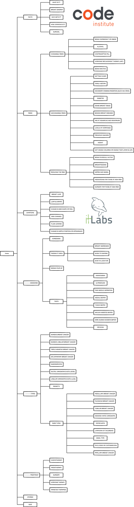

#### Aims
<ol>
    <li>To be a safe non-judgemental environment for anybody affected by breast cancer to learn more about the pathology</li>
    <li>To be a highly user intuitive application for all users</li>
    <li>To be highly accessible in terms of colour scheme and contrast to cater for the needs of those with sensory needs</li>
    <li>To be a learning tool for everybody that visits the site</li>
    <li>To be a place for those affected by breast cancer to read other people's experiences and stories</li>
    <li>To be a fun and positive experience when most experiences surrounding breast cancer are scary and upsetting</li>
    <li>To be a stepping stone for individuals who want to learn more by supplying further reading with external links</li>
</ol>

#### Target Audience
<ol>
    <ul>Everybody</ul>
    <ul>Although the majority of those who develop breast cancer are in the female over 50 demographic, the disease itself affects everybody, whether that's someone we know that has suffered from it, someone that has been told they're more at risk, or someone that has just had thoughts surrounding it. This web application is for all of those people and everyone in between. Cancer doesn't discriminate, and neither do we.</ul>
</ol>

#### User Stories
As a new and returning user I want to:
<ol>
    <li>Know the purpose of the website as soon as I navigate to the home/landing page</li>
    <li>Navigate the website quickly and effectively</li>
    <li>Find everything in the website that I need to find with ease</li>
    <li>Have visual aids and obvious calls to action throughout the site to aid in user intuitiveness</li>
    <li>Have up to date and relatable stroies from individuals affected by breast cancer</li>
    <li>Have a pleasant experience when visiting the site and get the facts surrounding breast cancer</li>
</ol>   

#### Feasibility vs Importance
<table>
    <tr>
        <th>Opportunity/Feature</th>
        <th>Feasibility/Viability (score out of 5)</th>
        <th>Level of Importance (score out of 5)</th>
        <th>In or out?</th>
    </tr>
    <tr>
        <td>Obvious role of the website demonstrated with hero image/video and/or capture text</td>
        <td>4</td>
        <td>5</td>
        <td>In</td>
    </tr>
    <tr>
        <td>Simple design with straightforward navigation to make it easier for the user to understand where to find information</td>
        <td>5</td>
        <td>5</td>
        <td>In</td>
    </tr>
    <tr>
        <td>Relevant and relatable stories of people's experiences with breast cancer</td>
        <td>4</td>
        <td>4</td>
        <td>In</td>
    </tr>
    <tr>
        <td>Facts from reputable sources explaining different things about breast cancer</td>
        <td>3</td>
        <td>5</td>
        <td>In</td>
    </tr>
    <tr>
        <td>A simple quiz for site users to interact with to test their knowledge around breast cancer and it's awareness</td>
        <td>3</td>
        <td>3</td>
        <td>In</td>
    </tr>
    <tr>
        <td>Videos situated at opportune moments throughout the site to help raise awareness of breast cancer</td>
        <td>3</td>
        <td>4</td>
        <td>In</td>
    </tr>
    <tr>
        <td>A fairly gender neutral site in terms of colour scheme to encourage everybody to stay on the site as this topic affects everybody</td>
        <td>5</td>
        <td>3</td>
        <td>In</td>
    </tr>
    <tr>
        <td>A news api to have updated articles on breast cancer related topics</td>
        <td>2</td>
        <td>3</td>
        <td>Out</td>
    </tr>
    <tr>
        <td>A site user forum for anyone affected by breast cancer to connect with each other and share their journeys</td>
        <td>1</td>
        <td>2</td>
        <td>Out</td>
    </tr>
    <tr>
        <td></td>
        <td>Average Viability x number of features:  30</td>
        <td>Sum of Importance:  34</td>
        <td></td>
    </tr>
</table>
As we can see from the table above, the importance is higher than the viability, which which means that we may run into some problems during the implementation of the web-app if we were to implement all of these features. There are things that we would like to implement but would not have the means or knowledge or time to implement them. Therefore the web-app will take a more basic layout, and we will work within the confines of our limitations to acheive the main goals we have set.

The table above has been plotted into a graph (below) to easily visualise the features that will be implemented into the web application and which ones won't be:
<ul>
    <li>The features in the pink section will be implemented</li>
    <li>The features in the grey section could be implemented at a later date but aren't necessary right now</li>
    <li>The features in the turquoise section will not be implemented as it would be unwise to focus on these features until a later date</li>
</ul>
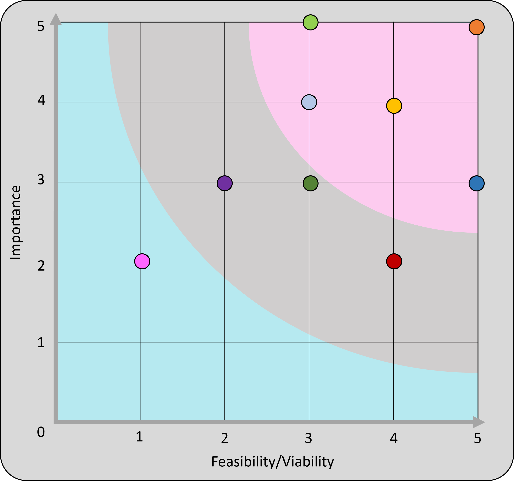 
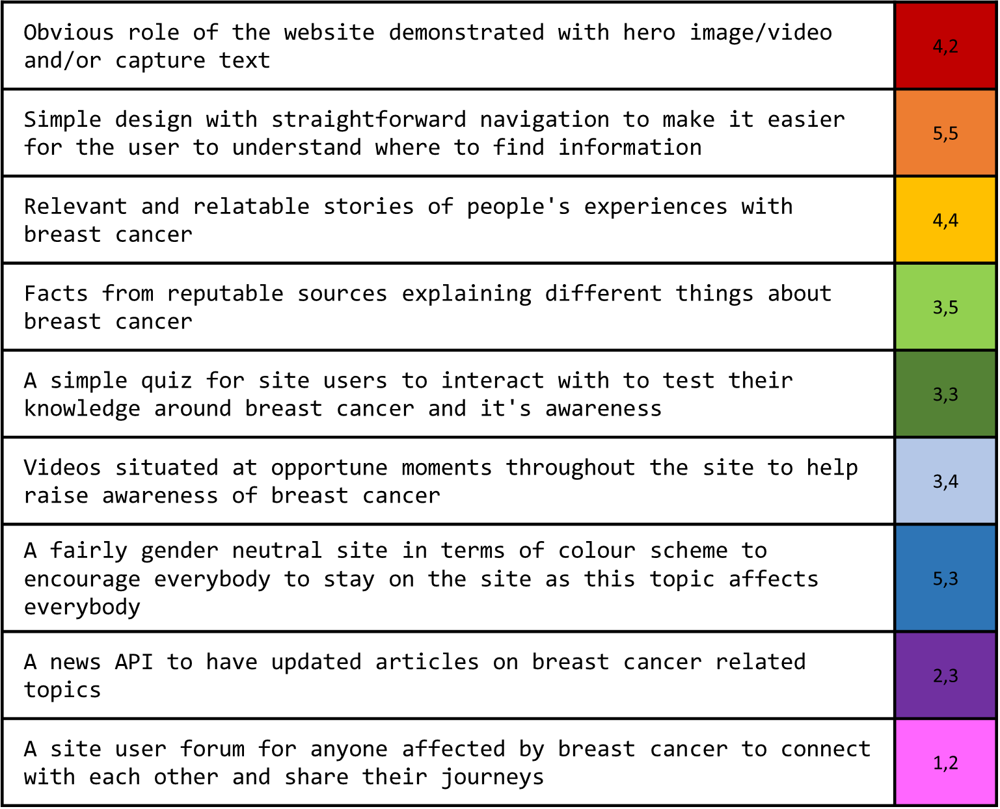

### Scope

We have chosen to design and implement our web-application based on the MVP (Minimum Viable Product) model. This allows us to create a fully functioning web-app with the least amount of content while still having the website functionable for users. This allows us to see if the website has a positive reaction before more development work takes place (for example implementing features that we have chosen to leave out for the moment). 

The MVP model will:
<ul>
    <li>Create a clear website with enough content for the customers wants and needs to be fulfilled without having dedicated too much time to the project itself</li>
    <li>Allow us to work within the scope of our abilitiy while also allowing us to challenge ourselves</li>
    <li>Result in a website with medium levels of UX without dedicating too much time to the project</li>
    <li>Result in a basic yet easy to use and functional website for site visitors</li>
</ul>
While following the MVP model, to meet the user and developer goals, our website will include:
<ul>
    <li>A self-designed logo on all pages as assurance to the customer we are a trusted resource with our own identity</li>
    <li>A nav-bar on all pages to be able to navigate to separate pages on the website</li>
    <li>Links to associalted social media on all pages within the footer</li>
    <li>A medium amount of visual content including videos as an alternative way for users to learn about breast cancer</li>
    <li>A small web-quiz for users to interact with as an alternative way of learning about breast cancer</li>
</ul>

### Structure

We have chosen to carry out a very basic linear method of design for this website, and have a layout that is both logical and easy to understand for any user that visits the site. By having multiple pages we can separate quite important information into logical sections to make it easier for the user to find what they are looking for. The navigation bar at the top of all of the pages allows the user to easily navigate to the page of the website they are most interested in.

<strong>On index.html</strong>: This page will consist of the main website branding, a front-and-center informative video on how to check your breasts in 60 seconds, six real-life stories from a range of people with different backgrounds as well as a callout for the user to gain quick and easy access to the breast cancer review quiz.
<strong>On facts.html</strong>: This page will consist of facts around breast cancer that may not necessarily be well known, it is our hope that these more unusual facts will stick in people's minds and at least get them thinking about breast cancer - thinking about one of these more unusual facts (no matter how random) is still someone thinking about breast cancer, and as long as they're thinking about breast cancer that's someone we have helped to gain more awareness.
<strong>On risks.html</strong>: This page is more educational for users to the site. By raising awareness of the risks of breast cancer, it may help to raise awareness in people who have one or more of these risk factors.
<strong>On symptoms.html</strong>: This page will consist of the symptoms to look out for as in indicator for breast cancer. There are still so many people that put off going to the doctor because they don't think their symptoms are anything to worry about. It is our hope that having this information easily accessible it will encourage people to look our for these symptoms and encourage early detection and diagnosis.
<strong>On quiz.html</strong>: This page will be an interactive activity for the user. Everybody learns in different ways, and it's rare for people to learn purely by reading information on a screen or a piece of paper. By having a learning source that is more interactive, we hope to target those that are more kinesthetic learners.

### Skeleton

The wireframes for <em>The Breast Review</em> website were made with the <a href="https://balsamiq.com/" target="_blank">Balsamiq</a> Desktop Applictaion, they can be found by viewing the images below. We created the wireframes for both mobile and desktop versions. As the trend for mobile browser usage has been on an upwards trend for the last 10 years in Europe culminating in a crossover of hardware usage in the recent year, it could be assumed that these trends will continue and result in users opting more and more for a mobile browser instead of a desktop. 

index.html 
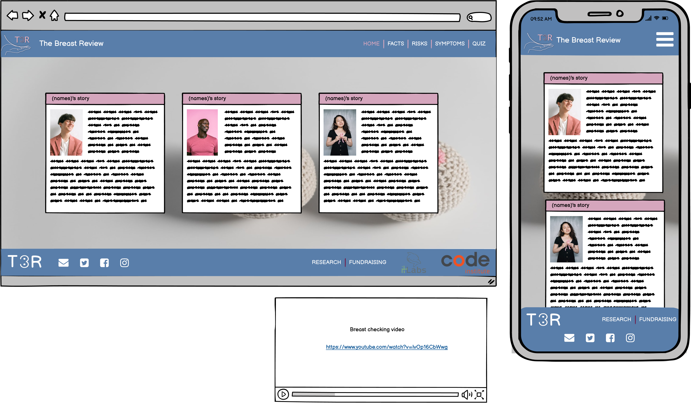  
facts.html 
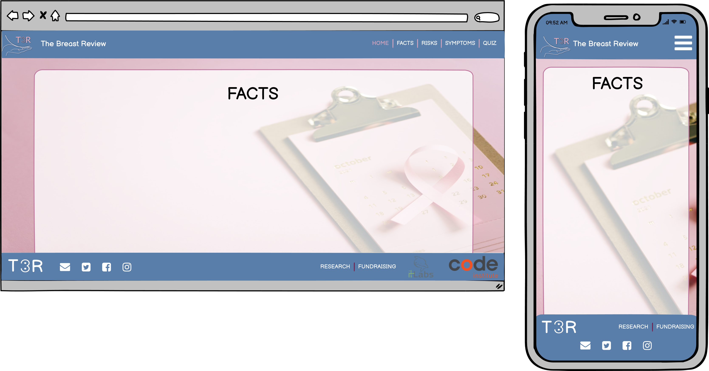  
risks.html 
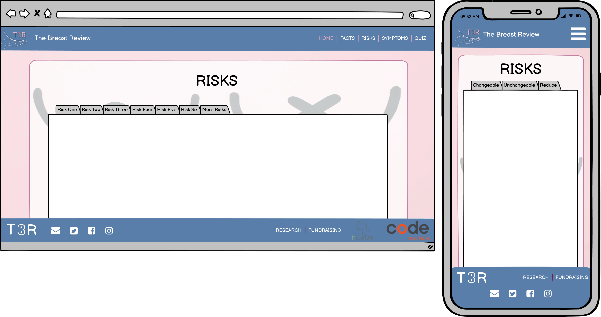  
symptoms.html 
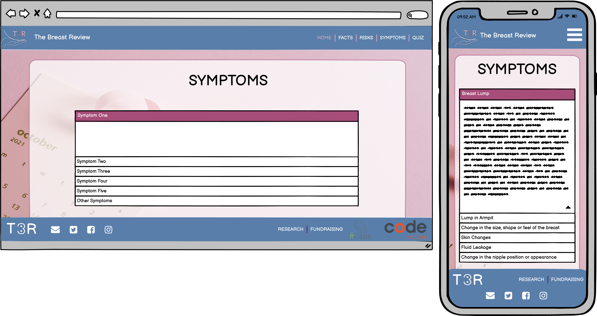  
quiz.html 
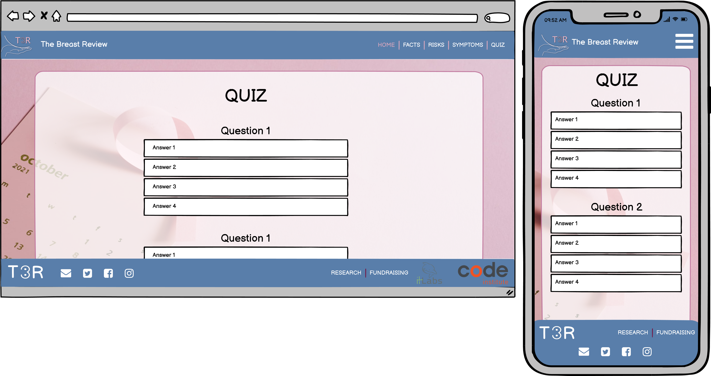 

The wireframes were created during the website's initial desgin process, as such there are small changes between the layout of the wireframes and the final layout/design of the finished website.

### Surface
#### Typography

We used <a href="https://fonts.google.com/" target="_blank">Google Fonts</a> to find the typography that we felt would fit best for the website. We wanted to use a completely different font for the main titles and the headers to the main text body of the website to distinguish between headers and main body, but also to show the importance of different sections and make it obvious for the user when a new section is starting. We chose to use the font 'Satisfy' (seen below) as the cursive writing and free-flow design of it makes it feel more relaxed and feminine, which we felt was important for the site - although we have tried to stay fairly gender neutral, there is no denying that the main target for this website is women as they account for the majority of breast cancer diagnoses and fatalities. 
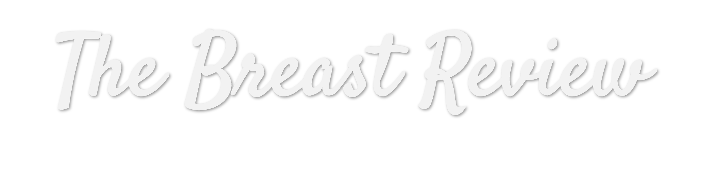 

The font we used for the main text body of the website was 'Pacifico' as this font is easy to read which is needed when there is large amounts of information to be read and absorbed by users, it has a modern feel, and is a popular font for many websites. The back-up font is 'Sans-Serif' just in case the font import link fails.

#### Colour Scheme
Throughout the site, we have tried to stay fairly gender neutral with the colour scheme, showing different elements in pink as well as a grey-blue colour. The universal symbol for breast cancer awareness is a pink ribbon, and the main demographic of users to the site will be female, so it made sense to us to have elements that are pink in majority. However, for elements such as the nav bar and footer we have chosen a more gender-neutral grey-blue, as (although it is rare) there are cases of male breast cancer and breast cancers in people who have transitioned from the gender they were assigned at birth. We have found these colour to be soft and none-offensive as well highly contrastable to the text that overlays them.

#### Icons
<em>The Breast Review</em> logo was handmade by the team "Mammary Mates" during the website development process. We felt this was a very important aspect to get done quickly as this would give us a feel for how the website would take shape. The logo itself consists of the website's brand letters (TBR) as well as a graphic of a hand underneath a curve - to represent a breast. The logo follows the colour scheme of the website and gives an obvious feel as to the content of the website.

#### Images (if used)
All images on the website were taken from pixabay, except for the images of the individual's who's stories are on the home page - these come from the stories that are available online via the links that are available in the story excerpts.

#### Videos (if used)
The background videos used in index.html have been taken from an open source website called Mixkit. We stored these in an online media content store (cloudinary) to ensure quick load times.
The breast checking video came from youtube and can be found <a href="https://www.youtube.com/watch?v=lvOp16CbWwg&t=1s" target="_blank">HERE</a>

## Technologies

### Languages
<ol>
    <li><a href="https://en.wikipedia.org/wiki/HTML5" target="_blank">HTML</a>
        <ul><li>The main structure of the website</li></ul>
    </li>
    <li><a href="https://en.wikipedia.org/wiki/CSS" target="_blank">CSS</a>
        <ul><li>For the design of the site</li></ul>
    </li>
    <li><a href="https://en.wikipedia.org/wiki/JavaScript" target="_blank">JavaScript</a>
        <ul><li>For the quiz in quiz.html</li>
        <li>For the hamburger menu on all pages at small screen sizes</li></ul>
    </li>
    <li>Limited <a href="https://en.wikipedia.org/wiki/Python_(programming_language)" target="_blank">Python</a>
        <ul><li>For hosting a local server during for testing</li></ul>
    </li>
    <li><a href="https://www.markdownguide.org/" target="_blank">Markdown</a>
        <ul><li>For the content and structure of the README.md</li></ul>
    </li>
    <li><a href="https://en.wikipedia.org/wiki/Bash_(Unix_shell)" target="_blank">Bash</a>
        <ul><li>For the CLI of gitpod.io environment and commands for depoloyment to GitHub</li></ul>
    </li>
</ol>   

### Version Control
<ol>
    <li><a href="https://github.com/" target="_blank">Git & Github</a>
        <ul><li>For the hosting and version control of the website as well as storage for media content on the website</li></ul>
    </li>
    <li><a href="https://www.gitpod.io/" target="_blank">Gitpod</a>
        <ul><li>The development environment used for writing the code for the website</li></ul>
    </li>
</ol>

### Applications    
<ol>
   <li><a href="https://balsamiq.com/" target="_blank">Balsamiq (Desktop)</a>
        <ul><li>For the creation of wireframes</li></ul>
    </li>
    <li><a href="https://visualstudio.microsoft.com/" target="_blank">Visual Studio (Desktop)</a>
        <ul><li>For testing out ideas without interfering with code for website</li></ul>
    </li>
    <li><a href="https://slack.com/intl/en-gb/" target="_blank">Slack (Desktop)</a>
        <ul><li>For communicating with peers and troubleshooting problems with the different environments used during the course and coding.</li></ul>
    </li>
</ol>
    
### Frameworks, Libraries and Programs 
<ol>  
    <li><a href="https://developer.chrome.com/docs/devtools/" target="_blank">Chrome Developer Tools</a>
        <ul><li>To test the responsiveness of the website at varying screen sizes</li></ul>
    </li>
    <li><a href="https://fonts.google.com/" target="_blank">Google Fonts</a>
        <ul><li>Used to import the 'Satisfy' and 'Lato' fonts used throughout the website</li></ul>
    </li>
    <li><a href="https://fontawesome.com/" target="_blank">Font Awesome</a>
        <ul><li>Used on all pages throughout the website to enhance UX and design, also for the tab icon</li></ul>
    </li>
    <li><a href="https://favicon.io/" target="_blank">Favicon.io</a>
        <ul><li>Used to create the tab icon from an original PNG file</li></ul>
    </li>
    <li><a href="https://validator.w3.org/" target="_blank">W3C Markup Validation Service</a>
        <ul><li>To test and search for errors in the HTML code</li></ul>
    </li>
    <li><a href="https://jigsaw.w3.org/css-validator/" target="_blank">Jigsaw W3C CSS Validation Service</a>
        <ul><li>To test and search for errors in the CSS code</li></ul>
    </li>
    <li><a href="http://ami.responsivedesign.is/" target="_blank">Am I responsive</a>
        <ul><li>To show the responsiveness of the website on different screen sizes at the same time</li></ul>
    </li>
    <li><a href="https://wave.webaim.org/" target="_blank">WAVE Web Accessibility Evaluation Tool</a>
        <ul><li>To ensure compliance with accessibility</li></ul>
    </li>
    <li><a href="https://getbootstrap.com/" target="_blank">Bootstrap</a>
        <ul><li>For the general layout of the website, the navbar and the accordian elements throughout the site</li></ul>
    </li>
</ol>   

## Features
### Implemented Features
The main features to be implemented in the website were determined in the Strategy plane of the UX section. We were able to recognise which features were more likely to have a positive impact on the website and implement those, while staying within the time constraints we had and staying within our own coding knowledge and comfort.
<ul>
    <li><em>Obvious role of the website demonstrated with hero image/video and capture text</em> - We have tried to make the landing page (catering for all screen sizes) as obvious as possible to identify the role and purpose of the website. The background video itself shows a person holding a pink ribbon which is folded to imitate the breast cancer awareness symbol; this identifies to the customer that the website is likely to be about some form of breast cancer awareness. The cover text over the video "The Breast Review" further identifies to the customer the role of the website.</li>
    <li><em>Simple design with straightforward navigation to make it easier for the user to understand where to find information</em> - The website has a simple design throughout, with each page having it's own title and each page having separate sections. The font and colours throughout are all the same adding continuity and familiarity to the website - improving user experience. These elements were all styled using CSS with psuedo classes for hover actions to enable the customer to visualise a transitioning style.</li>
    <li><em>Relevant and relatable stories of people's experiences with breast cancer</em> - These are situated on the main page of the website (index.html), we have included stories from people from all walks of life (two young women that are below the average age for a diagnosis of breast cancer, an older genteman, a male-to-female transgendered person, a female-to-male transgendered person and one person who is from the 'average' demographic from someone that has been diagnosed with breast cancer.</li>
    <li><em>Facts from reputable sources explaining different things about breast cancer</em> - The majority of the facts and information found on the website has come from Cancer Research UK. This amazing charity had done amazing things including peer reviewed research which allows us to share up-to-date and accurate information with the site users.</li>
    <li><em>A simple quiz for site users to interact with to test their knowledge around breast cancer and it's awareness</em> - </li>
    <li><em>Videos situated at opportune moments throughout the site to help raise awareness of breast cancer</em> - As soon as anyone navigates to the site they are greeted with a quick 60 second video on how to check for breast cancer. There are also background videos in index.html for varying screensizes related to breast cancer awareness.</li>
    <li><em>A fairly gender neutral site in terms of colour scheme to encourage everybody to stay on the site as this topic affects everybody</em> - Please see surface section of UX for explanation on colour scheme and why we chose certain colours.</li>
</ul>

### Features Left to Implement
<ul>
    <li><em>A news api to have updated articles on breast cancer related topics</em> - We decided to leave this out due to time constraints and the extreme mix in coding abilities throughout our team. To reduce the risk of segregating team members, we chose to stick to the main trinity of programming languages (HTML, CSS and JS). However at a future time there could be the potential to add a news API to the website to update periodically for the user to be continually learning about new breast cancer related stories and articles.</li>
    <li><em>A site user forum for anyone affected by breast cancer to connect with each other and share their journeys</em> - We decided to leave this out due to time constraints and the extreme mix in coding abilities throughout our team. To reduce the risk of segregating team members, we chose to stick to the main trinity of programming languages (HTML, CSS and JS). However at a future time there could be the potential to add a forum feature by using django and it's user authorisation feature.</li>
</ul>

## Testing

To make the testing of our website easier and more structured, we have decided to carry out a structured approach to testing, and test the following things: Functionality, Compatibility, User Testing Stories, Code Validation, Peer Review, Development Problems, Accessibility and Performance Testing.

### Functionality

The first section of our testing structure for the website was to look at the functionality of the website and make sure that it meets the needs of the use on the most basic levels and also to ensure that all the interactive aspects of the website all worked with no problems.

<ul>
    <li>All internal links on the website need to be usable, and open in the same window.
        <ul>
            <li>All links in the menu bar at the top of all pages will direct the customer to the relevant page: 'Home' - to index.html, 'Facts' - to facts.html, 'risks' - to risks.html, 'Symptoms' - to symptoms.html and 'Quiz' - to quiz.html</li>
            <li>The button in the callout section at the bottom of index.html will direct the customer to the quiz page</li>
        </ul>    
    </li>       
    <li>All external links on the website need to be usable, and open in a new window.
        <ul>
            <li>The social media links in the footer of all pages will direct the customer to the relevant social media platform in a new tab.</li>
            <li>The 'read more about [person]'s story' links in index.html sections will direct the customer to the related story pages in a new tab.</li>
            <li>The reference link in facts.html will direct the user to the related website in a new tab.</li>
            <li>The fundraising and research links in the footer of all pages will direct the user to cancer research uk relevant pages in a new tab.</li>
            <li>The youtube videos embeded in index.html and symptoms/html work with no problems and direct to the video page when clicked</li>
        </ul>    
    </li>  
    <li>All elements with an associated psuedo class work when the action is carried out (e.g. Hover).
        <ul>
            <li>All internal link buttons in the nav bar will have a subtle colour change when the user hovers over them</li>
            <li>The call to action button text at the bottom of index.html will change colour when the user hovers over it</li>
            <li>The start button in quiz.html will change colour when the user hovers over it</li>
            <li>All social media and external links in the footer will change colour when the user hovers over them</li>
        </ul>    
    </li>     
</ul> 

### Compatibility

The second section of our testing regime for the website was to ensure that the website is compatible through a range of devices, screen sizes and internet browsers. Throughout the development process, the website was tested on a number of devices: 

<ul>
    <li>17.3 inch laptop running windows</li>
    <li>15.3 inch laptop running ubuntu</li>
    <li>16 inch MacBook Pro</li>
    <li>8 inch Samsung Galaxy Tab A</li>
    <li>iPad mini</li>
    <li>iPhone 8</li>
</ul>

It was also tested in Chrome, Firefox, Internet Explorer and Safari as well as Samsung's own internet browser. By also using Chrome Dev Tools, we were able to manually change the screen size to see when elements within the web pages 'break', by using this method, we could pinpoint the exact screen widths and heights to be defined in the CSS media screen queries and alter the stylings to fit accordingly. 
The video below shows how we checked the responsiveness of the website at all screensizes.  
 

### User Testing Stories

The third section of our testing structure was to ensure that customer all user stories identified in the strategy plane have been acknowledged and achieved.  

<em>"I want to know the purpose of the website as soon as I navigate to the home/landing page" & "I want to navigate the website quickly and effectively" & "I want to find everything in the website that I need to find with ease"</em> 
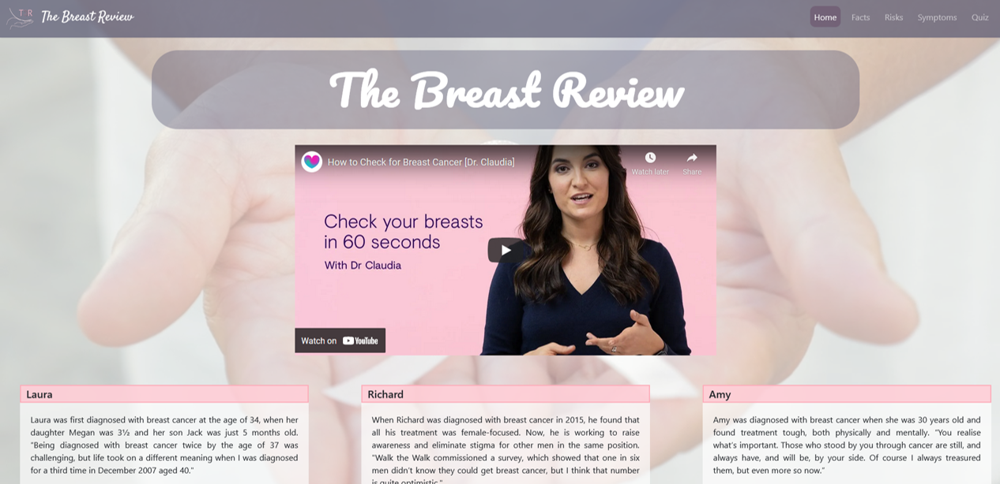 

>We have tried to make the website as intuitive as possible. From the first time the user navigates to the home page we have tried to make it so the user is aware straight away of the function of the website by including relevent video footage and cover text to exaplain what the website is for. As soon as the user navigates to the home page, the things they should see are as follows: The 'hero' video, the menu/nav bar, the logo image and the website 'title': <em>The Breast Review</em>. We have used straightforward terminology in the navigation bar so the user knows where they are navigating to and what they will find once they have navigated there. 

<em>"I want to have visual aids and obvious calls to action throughout the site to aid in user intuitiveness"</em> 
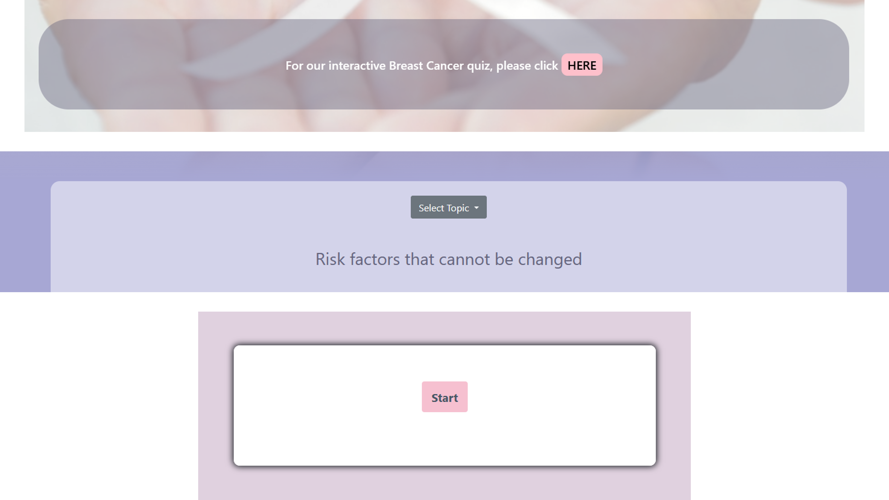 

>There are separate pages within the website for the user to browse at their leisure to learn about breast cancer awareness. We feel that the main alternative feature of our website is the fact we are including a breast-cancer awareness quiz, so we chose to have a callout to this page on the main home page to encourage more user visits to this page. 

<em>"Have up to date and relatable stroies from individuals affected by breast cancer"</em> 
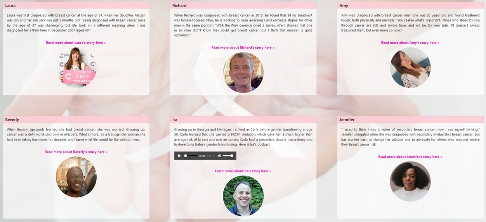 

>On the main home page, there are 6 stories featured of people who have been affected by breast cancer. We have made these stories relatable, accessible and inclusive of all genders. We hope that by having these stories front-and-center in the website it will raise more awareness of the fact that everybody is at risk of breast cancer, not just women over 50. 

<em>"Have a pleasant experience when visiting the site and get the facts surrounding breast cancer"</em> 

>Throughout the website we have tried to keep the main theme informative rather than emotional/scare-tactics which is what some cancer awareness websites use. The facts.html, risks.html and symptoms.html are purely factual pages to try and help the user raise their awareness of breast cancer in a neutral, non-biased environment. By having the quiz incorporated into the website, this gives the user a positive and interactive task to carry out while also raising their awareness of breast cancer. 

### Code Validation

The fourth section of our testing structure for the website was to ensure all code written passes through code validation software with no errors or warnings.

#### HTML Code validation

##### INDEX.HTML
The below code validation report is from index.html. There were minimal errors found on this page. The main 'errors' were repeated id attributes, images without alt attributes and image elements with height and width attributes that included 'px' at the end of the value. These were rectified by replacing the id attributes with class attributes instead, adding alt attributes to images and removing the px from size attributes of images.  
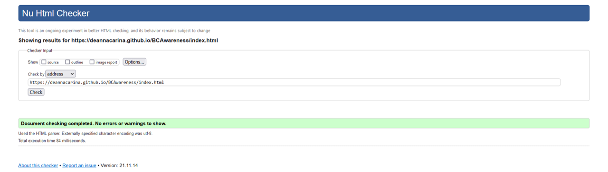 

##### FACTS.HTML
The below code validation report is from facts.html. There were minimal errors found on this page. The main 'errors' were repeated id attributes, images without alt attributes and image elements with height and width attributes that included 'px' at the end of the value. These were rectified by replacing the id attributes with class attributes instead, adding alt attributes to images and removing the px from size attributes of images.  
 

##### RISKS.HTML
The below code validation report is from risks.html. There were minimal errors found on this page. The main 'errors' were the same ones as the errors found in index.html and facts.html which were rectified in the same ways, as well as errors concerning having a hr element as a child of a ul element, these errors were rectified and the code re-run through the validator. 
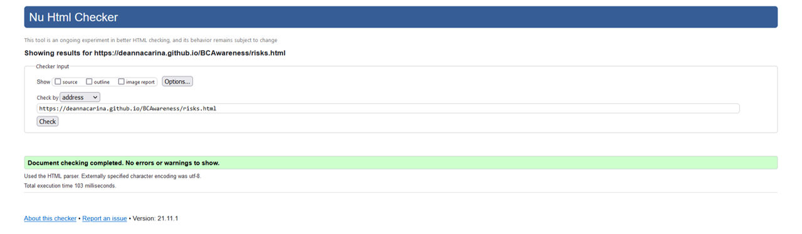 

##### SYMPTOMS.HTML
The below code validation report is from symptoms.html. There were minimal errors found on this page. The main 'errors' were the same ones as the errors found in index.html and facts.html which were rectified in the same ways, as well as errors concerning having a hr element as a child of a ul element, these errors were rectified and the code re-run through the validator. 
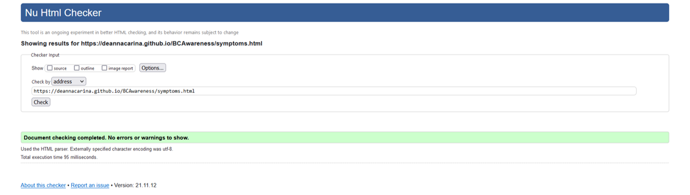 

##### QUIZ.HTML
There were minimal errors found on this page. The main 'errors' were the same ones as the errors found in index.html and facts.html which were rectified in the same ways.There were also warnings concerning multiple hypens within comments, however this was left as having comments within code is best practice to make the code more readable and editable in the future. 
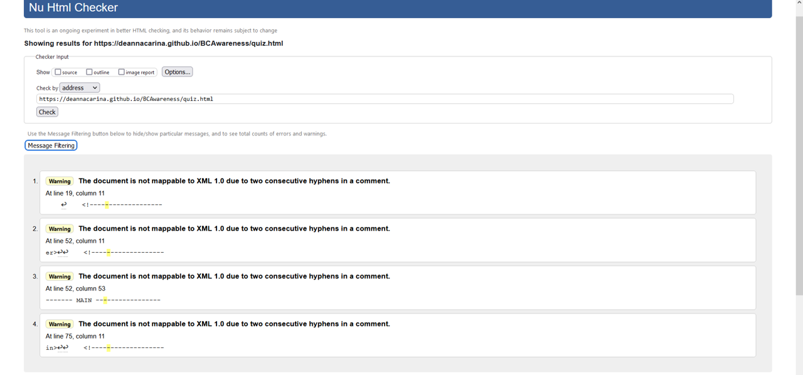 

#### CSS Code validation

No errors or warnings were found in the CSS validation process. 
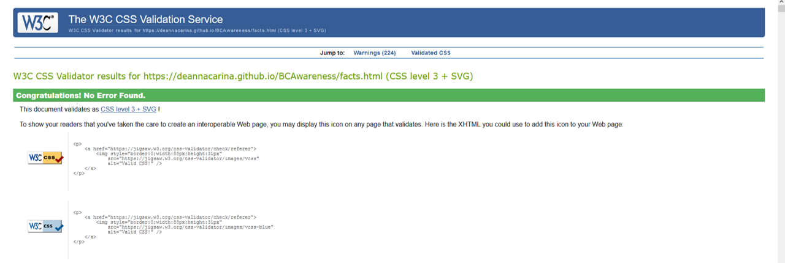 

#### JS Code validation

Each of the JavaScript files were run separatly through the JSHint validator:

FACTSSCRIPT.JS: No errors or warnings were found in the JS validation process. 
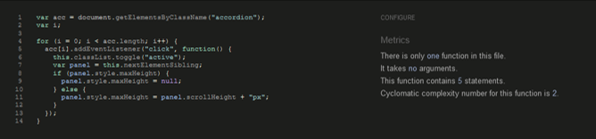 

QUIZ.JS: No errors or warnings were found in the JS validation process. 
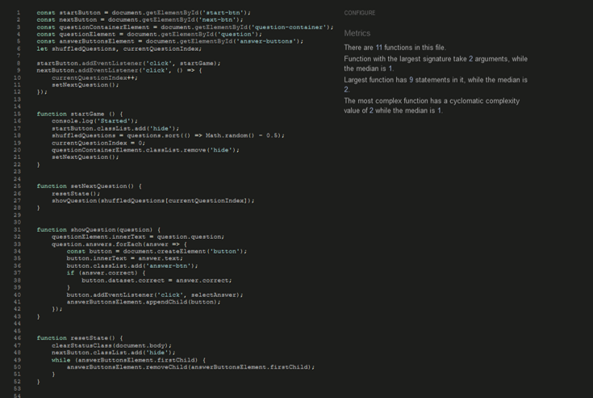 

RISKSCRIPT.JS: No errors or warnings were found in the JS validation process. 
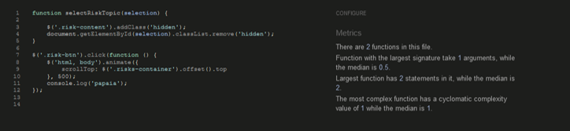 

SCRIPT.JS: No errors or warnings were found in the JS validation process. 
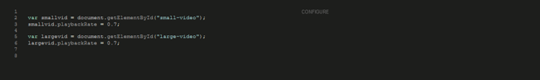 

### Issues Found During Deployment

No issues were found during deployment. The website is hosted through GitHub pages which hosts static web-pages. This process is very straightforward and no problems arose from deployment.

### Accessibility

All web pages were run through the wave accessibility tool, the only error was from the logo not having an alt attribute in quiz.html, this was rectified before project submission deadline:

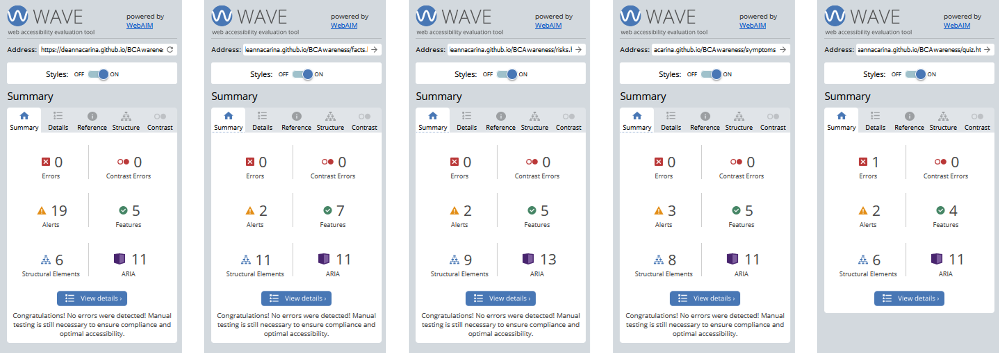 

### Performance Testing

In order to test the performance of the website we used the built-in Chrome DevOps tool: Lighthouse. 
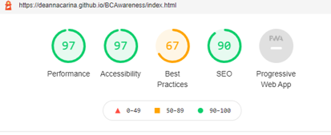 

## Deployment
A live demo of the website can be found <a href="https://deannacarina.github.io/BCAwareness/" target="_blank">**HERE**</a> 

### Project Creation
This project was created on GitHub and Edited in GitPod by carrying out the following:
<ol>
    <li>A new repository was created using 'Code-Instutute-Org/gitpod-full-template'</li>
    <li>A meaningful name was given to the new repository and 'Create Repository' was selected</li>
    <li>The repository was then opened on GitHub by clicking the 'Gitpod' button to build the GitPod workspace which would allow us to build and edit the code used to make the <em>[Project Name]</em> website/application</li>
    <li>Version control was used throughout the project using the following commands in the terminal using Bash
        <ul>
            <li>git pull origin main - to pull the latest updated files from the main branch to the local repository</li>
            <li>git checkout -b "branch name" - to move to a new branch off the main branch</li>
            <li>git add . <strong>OR</strong> git add "file name" - to stage the changes and get them ready for being committed to the local repo.</li> 
            <li>git commit -m "Description of the update" - to save the change and commit the change to the local repo</li>
            <li>git push origin "branch name" - to push all committed shanges to the GitHub repo associated with the GitPod workspace</li>
            <li>The pushed changes were then reviewed by fellow collaborator(s) and merged with the main branch</li>
        </ul>
    </li>

### Project Deployment

### Local Deployment
There are many ways to deploy the project locally on your own device. The ways we will explain here are: Forking, Cloning, GitHub Desktop and Zip Exctraction, the steps in these processes are outlined below:

#### Forking the GitHub repo
If you want to make changes to the repo without affecting it, you can make a copy of it by 'Forking' it. This will make sure that the original repo remains unchanged.
<ol>
    <li>Log in to your GitHub account</li>
    <li>Navigate to the repository <a href="https://github.com/DeannaCarina/BCAwareness"><strong>HERE</strong></a></li>
    <li>Select the 'Fork' button in the top right corner of the page (under your account image)</li>
    <li>The repo has now been copied into your own repos and you can work on it in your chosen IDE</li>
    <li>If you have any suggestions to make regards to the code to make the site better, you can put in a pull request</li>
    <li>If you want to create a web-app from the repo please follow the instructions in "Project Deployment"</li>
</ol>

#### Cloning the repo with GitPod
<ol>
    <li>Log in to your GitHub account</li>
    <li>Navigate to the Repository <a href="https://github.com/DeannaCarina/BCAwareness"><strong>HERE</strong></a></li>
    <li>Select the 'Code' button above the file list on the right had side</li>
    <li>Ensure HTTPS is selected and click the clipboard on the right of the URL to copy it</li>
    <li>Open a new workspace in GitPod</li>
    <li>In the bash terminal type 'git clone [copy url here from step 4]'</li>
    <li>Press enter - the IDE will clone and download the repo</li>
    <li>You can then type 'python3 -m http.server' to host the website locally - this will not run the python file, only allow you to check how the web-app looks.</li>
    <li>If you want to create a web-app from the repo please follow the instructions in "Project Deployment"</li>
</ol>

#### Github Desktop
<ol>
    <li>Log in to your GitHub account</li>
    <li>Navigate to the Repository <a href="https://github.com/DeannaCarina/BCAwareness"><strong>HERE</strong></a></li>
    <li>Select the 'Code' button above the file list on the right had side</li>
    <li>Select 'Open with GitHub Desktop'</li>
    <li>If you haven't already installed GitHub desktop application - you will need to follow the relevant steps to do this</li>
    <li>The repo will then be copied locally onto your machine</li>
    <li>If you want to create a web-app from the repo please follow the instructions in "Project Deployment"</li>
</ol>

#### Download and extract the zip directly from GitHub
<ol>
    <li>Log in to your GitHub account</li>
    <li>Navigate to the Repository <a href="https://github.com/DeannaCarina/BCAwareness"><strong>HERE</strong></a></li>
    <li>Select the 'Code' button above the file list on the right had side</li>
    <li>Select 'Download Zip'</li>
    <li>Once you have the Zip downloaded, open it with your prefered file decompression software</li>
    <li>You can then drag and drop the files from the folder into your chosen IDE or view/edit them on your local machine</li>
    <li>If you want to create a web-app from the repo please follow the instructions in "Project Deployment"</li>
</ol>

## Research
### DEFINITION:
### FACTS:

The information contained within the facts.html page has been taken from the following sources:

* [8 Interesting Facts About Breast Cancer on roche.com](https://www.roche.com/research_and_development/what_we_are_working_on/oncology/8-facts-about-breast-cancer.htm#fact_8)

* [Statistics about breast cancer from the World Health Organisation](https://www.who.int/news-room/fact-sheets/detail/breast-cancer)

* [More facts about breast cancer from breastcancer.org](https://www.breastcancer.org/symptoms/understand_bc/myths-facts)

* [General information about breast cancer from the NHS](https://www.nhs.uk/conditions/breast-cancer/)

* [Statistics about breast cancer from breastcancernow.org](https://breastcancernow.org/about-us/media/facts-statistics)

* [Information about second cancers from livestrong.org](https://www.livestrong.org/we-can-help/healthy-living-after-treatment/second-cancers)

### RISKS:

Information contained within the risks.html page has been taken from the following source:

* [Centers for Desease and Control and prevention](https://www.cdc.gov/cancer/breast/basic_info/prevention.htm)

### WHY IS THE WEB APPLICATION NEEDED?

## Credits
### Code
### Content
### Images
### Video
### Acknowledgements

## Screenshots
 
 
 
 
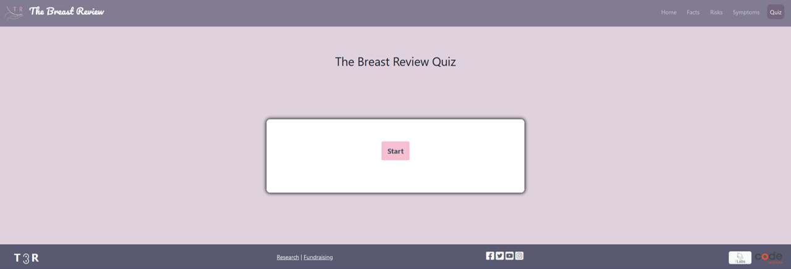 
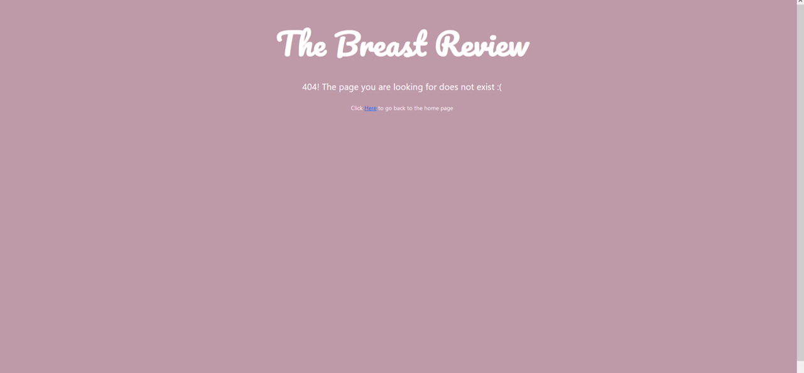

## References
